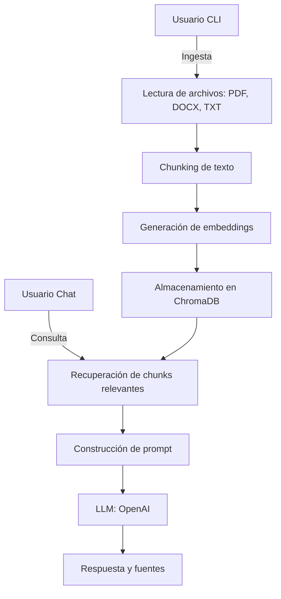

# RAGent

[](https://deepwiki.com/TheRamdomX/RAGent)
[](https://www.python.org/)
[](https://www.langchain.com/)
[](https://openai.com/)
[](https://www.trychroma.com/)
[](https://pypi.org/project/PyPDF2/)
[](https://pypi.org/project/python-docx/)
[](https://github.com/openai/tiktoken)
[](https://pypi.org/project/marker-pdf/)
[](https://pypi.org/project/python-dotenv/)

RAGent es un asistente conversacional basado en RAG (Retrieval-Augmented Generation) que responde preguntas utilizando información extraída de documentos (PDF, DOCX, TXT) y modelos de lenguaje (LLM). El sistema ingiere archivos, los procesa en chunks, genera embeddings, almacena los vectores en una base ChromaDB y utiliza un modelo LLM para responder preguntas apoyándose en el contexto recuperado.

Además, expone:

- API HTTP con FastAPI (`api.py`) para consultas desde un frontend u otros clientes.
- CLI con Typer (`main.py`) para ingestar, chatear por consola, listar y eliminar documentos.


## Flujo de datos

### Ingesta de archivos

1. El usuario ingresa archivos mediante la CLI ([main.py](main.py), [ingestion.py](app/data/ingestion.py)).

2. Los archivos se leen y procesan (PDF, DOCX, TXT).

3. El texto se divide en chunks ([chunking.py](app/data/chunking.py)). Nota: por diseño actual, se genera un único chunk grande por archivo, preservando el contexto completo del documento.

4. Se generan embeddings para cada chunk ([embeddings.py](app/models/embeddings.py)).

5. Los chunks y sus embeddings se almacenan en ChromaDB.

### Recuperación y respuesta

1. El usuario realiza una consulta en el chat.

2. El sistema recupera los chunks más relevantes desde ChromaDB usando embeddings ([retriever.py](app/rag/retriever.py)).

3. Opcionalmente, un agente ReAct (`app/rag/ReAct.py`) puede orquestar el proceso: invocar la herramienta `RAG_Search` para recuperar evidencia, razonar con el LLM y enriquecer la respuesta.

4. Se construye un prompt con el contexto recuperado y la pregunta del usuario ([qa.py](app/rag/qa.py)).

5. El prompt se envía al modelo LLM para generar una respuesta ([llm.py](app/models/llm.py)).

6. Se muestra la respuesta y las fuentes relevantes al usuario.

### Gestión de la conversación

1. Se mantiene un historial de turnos (usuario/asistente) ([conversation.py](app/controllers/conversation.py), [chatbot.py](app/chatbot.py)).

2. Se puede alternar entre modo RAG y modo LLM puro.

## Arquitectura por módulos (mapa del código)

- Interfaz
    - `api.py`: FastAPI con CORS. Endpoints: `/` (bienvenida), `/health`, `/api/query` (consulta). Mantiene un caché de chatbots por colección ("ramo").
    - `main.py`: CLI (Typer) con comandos `ingest`, `run`, `chat`, `list`, `delete`.

- Orquestación de conversación
    - `app/chatbot.py`: envoltorio ligero que delega en `ConversationManager`.
    - `app/controllers/conversation.py`: historial simple y decisión entre RAG o LLM puro.

- RAG
    - `app/rag/retriever.py`: abre Chroma persistente y recupera documentos relevantes; opcionalmente aplica re-ranking por similitud coseno.
    - `app/rag/qa.py`: arma un prompt con instrucciones de sistema, contexto (truncado por tokens con `tiktoken`) y la pregunta; invoca el LLM y retorna respuesta + documentos fuente.
    - `app/rag/ReAct.py`: agente ReAct (LangChain) con herramienta `RAG_Search`, con presupuesto de llamadas/tokens por consulta.

- Ingesta y chunking
    - `app/data/ingestion.py`: lectura de PDF (PyPDF2), DOCX (python-docx), TXT/MD; fallback opcional a Marker OCR si el PDF parece pobre en texto. Deduplicación exacta y por similitud de embeddings. Inserta `Document`s en Chroma.
    - `app/data/chunking.py`: normalización y chunking (1 chunk por archivo) con metadatos de rangos.
    - `app/data/marker.py`: integración con Marker (OCR y parsing robusto de PDF).

- Modelos
    - `app/models/embeddings.py`: `OpenAIEmbeddings` configurable.
    - `app/models/llm.py`: `ChatOpenAI` envuelto en `Agent`.

- Utilidades
    - `app/utils/config.py`: configuración centralizada vía variables de entorno.
    - `app/utils/logger.py`: logger a stdout.

## Diagrama de flujo de datos



## Componentes principales

- [main.py](main.py): CLI para ingesta y ejecución.
- [app/data/ingestion.py](app/data/ingestion.py): Procesamiento de archivos y chunks.
- [app/models/embeddings.py](app/models/embeddings.py): Generación de embeddings.
- [app/rag/retriever.py](app/rag/retriever.py): Recuperación de contexto relevante.
- [app/rag/qa.py](app/rag/qa.py): Construcción de prompts y respuestas.
- [app/rag/ReAct.py](app/rag/ReAct.py): Agente ReAct que orquesta razonamiento y llamadas a la herramienta RAG.
- [app/models/llm.py](app/models/llm.py): Interfaz con el modelo LLM.
- [app/controllers/conversation.py](app/controllers/conversation.py): Gestión del historial conversacional.
- [app/chatbot.py](app/chatbot.py): Interfaz de chat.

## API HTTP

Servidor FastAPI desde `api.py`.

- GET `/` — Bienvenida y metadatos.
- GET `/health` — Health check simple: `{ "status": "healthy" }`.
- POST `/api/query` — Consulta al chatbot.
    - Request JSON:
        - `prompt` (str): pregunta del usuario.
        - `ramo` (str): nombre de la colección/ramo (p. ej., `study_collection`).
        - `use_rag` (bool, opcional): override para usar/no usar RAG (por defecto true).
    - Response JSON:
        - `answer` (str): respuesta del asistente.
        - `sources` (string[], opcional): nombres de archivos fuente deduplicados, si hubo contexto.
        - `ramo` (str): colección usada.

Ejemplo (cURL opcional):

```bash
curl -X POST http://localhost:8000/api/query \
    -H 'Content-Type: application/json' \
    -d '{"prompt":"¿Qué es una derivada?","ramo":"study_collection","use_rag":true}'
```

## Uso básico (CLI)

- Ingesta de un archivo (colección opcional, por defecto `study_collection`):

```bash
python main.py ingest docs/algebra.pdf study_collection
```

- Ingesta de múltiples archivos con `--paths` (colección al final):

```bash
python main.py ingest --paths docs/a.pdf docs/notes.docx study_collection
```

- Modo chat (por defecto usa RAG y `study_collection`):

```bash
python main.py chat
```

- Ingesta + chat en un solo paso (posicionales `paths`):

```bash
python main.py run docs/file.pdf
```

- Listar archivos del RAG (usar `-a` para ver ids de ejemplo):

```bash
python main.py list
python main.py list -a
```

- Eliminar por archivo(s) o ids:

```bash
python main.py delete files/doc.pdf other.pdf
python main.py delete --ids id1,id2,id3
```

## Configuración (variables de entorno)

RAGent se configura principalmente mediante variables de entorno (usando `.env`). Las más relevantes:

- `OPENAI_API_KEY` — Clave de OpenAI para embeddings y LLM.
- `CHROMA_PERSIST_DIR` — Directorio donde se persiste la base ChromaDB (por defecto `./chroma_db`).
- `EMBEDDING_MODEL` — Modelo de embeddings (por defecto `text-embedding-3-small`).
- `LLM_MODEL` — Modelo LLM para generación (por defecto `gpt-4.1-nano`).
- `DEFAULT_TOP_K` — Número por defecto de documentos a recuperar en búsquedas.

- OCR y extracción de PDFs:
    - Ahora se usa siempre Marker OCR para PDFs durante la ingesta. Si fallara, se hace fallback a PyPDF2 automáticamente.
    - Variables relacionadas (si las usabas antes): `FORCE_MARKER_OCR`, `MARKER_OCR_THRESHOLD` (ya no afectan el comportamiento por defecto).

- Chunking y deduplicación:
    - `CHUNK_DEFAULT_SIZE` — Tamaño por defecto del chunk en caracteres (por defecto 400000, se usa 1 chunk por archivo).
    - `CHUNK_DEFAULT_OVERLAP` — Solapamiento entre chunks en caracteres (por defecto 100000; irrelevante con 1 chunk).
    - `MIN_CHUNK_CHARS` — Longitud mínima aceptable para un chunk (por defecto 500).
    - `DEDUP_SIM_THRESHOLD` — Umbral de similitud para marcar near-duplicates usando embeddings (0..1, por defecto 0.9).

- LLM / Agentes:
    - `LLM_TEMPERATURE` — Controla creatividad/determinismo del LLM (0.0 a 1.0, por defecto 0.7).
    - `LLM_MAX_COMPLETION_TOKENS` — Tokens máximos por respuesta del LLM.
    - `BUDGET_CALLS_PER_QUERY` — Límite de llamadas a herramientas por consulta en agentes (por defecto 5).
    - `RERANK_ENABLED` — Activa re-ranking por similitud coseno (por defecto true).
    - `RERANK_TOP_K` — Candidatos a recuperar antes de re-rankear (por defecto 20).
    - `MAX_MODEL_TOKENS` — Límite aproximado de tokens del modelo (por defecto 300000).
    - `RESERVED_RESPONSE_TOKENS` — Tokens reservados para la respuesta (por defecto 2048).

## Notas sobre OCR

Durante la ingesta de PDFs se invoca Marker OCR de forma incondicional. Si Marker falla, se registra el error y se intenta extraer texto con PyPDF2 como respaldo. Esto mejora la robustez para PDFs escaneados o con extracción nativa pobre.

## Detalles técnicos útiles

- Deduplicación: exacta (hash) y approximate por similitud coseno entre embeddings, controlada por `DEDUP_SIM_THRESHOLD`.
- Re-ranking: si `RERANK_ENABLED=true`, se obtienen `RERANK_TOP_K` candidatos y se ordenan por similitud coseno; luego se recortan a `k`.
- Control de tokens: `qa.py` usa `tiktoken` para truncar el bloque de contexto dentro de `MAX_MODEL_TOKENS - RESERVED_RESPONSE_TOKENS`.
- Caching de chatbots por colección (API): `api.py` mantiene instancias por "ramo" para evitar re-creación costosa.
